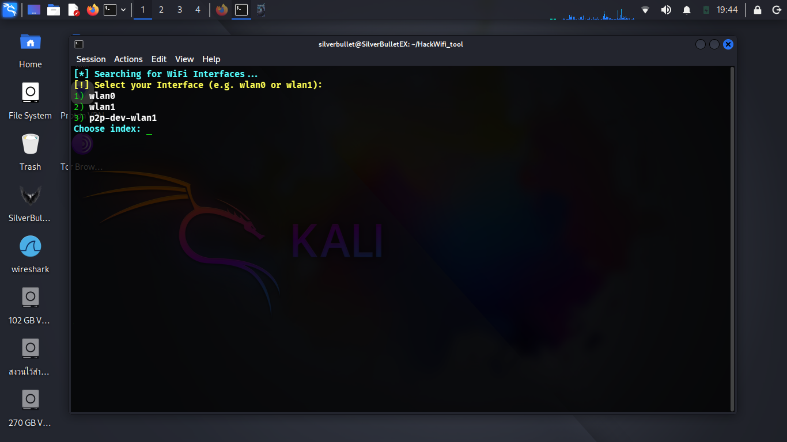
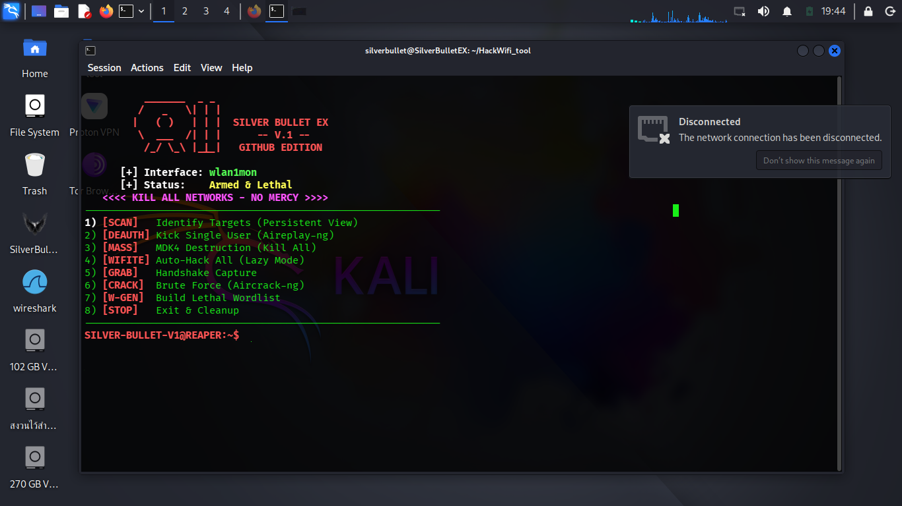
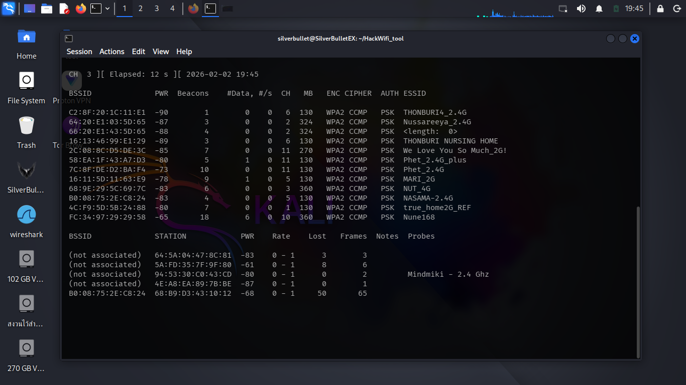
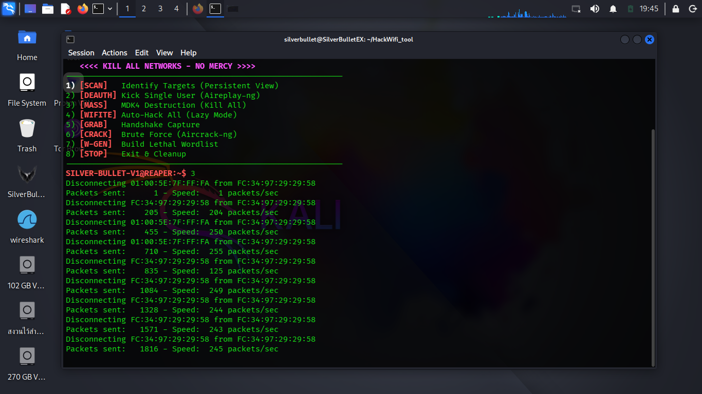

# 💀 SilverBulletEX V.1 💀
The Reaper Wireless Pentest Suite for Kali Linux

SilverBulletEX is an all-in-one wireless security auditing tool designed for professionals. It combines the power of MDK4, Aircrack-ng, and Wifite into a single, aggressive, and easy-to-use interface.

## ☠️ Features
* Auto-Monitor Mode: Automatically detects and enables monitor mode on wlan0, wlan1, or any external adapter.
* Persistent Scanning: View and lock target details (BSSID, CH, ESSID) even after stopping the scan.
* Mass Destruction: Integrated MDK4 for broad deauthentication attacks.
* Lazy Mode: One-click access to Wifite for automated auditing.
* Wordlist Generator: Built-in tool to create custom lethal wordlists.

## 🚀 Installation## 📸 Screen Demonstrations
To ensure you are using the authentic SilverBulletEX and to avoid fake versions, please refer to the official interface below:

  
  

  
  

> Note: Always verify the interface against these official screenshots to ensure your safety.

`bash
# Clone the repository
git clone [https://github.com/silverbulletex0-debug/All-Wifi-Jacking-](https://github.com/silverbulletex0-debug/All-Wifi-Jacking-)

# Enter the directory
cd SilverBulletEX_V1.sh

# Give execution permission
chmod +x SilverBulletEX_V1.sh

# Run the tool (Root required)
sudo ./SilverBulletEX_V1.sh
